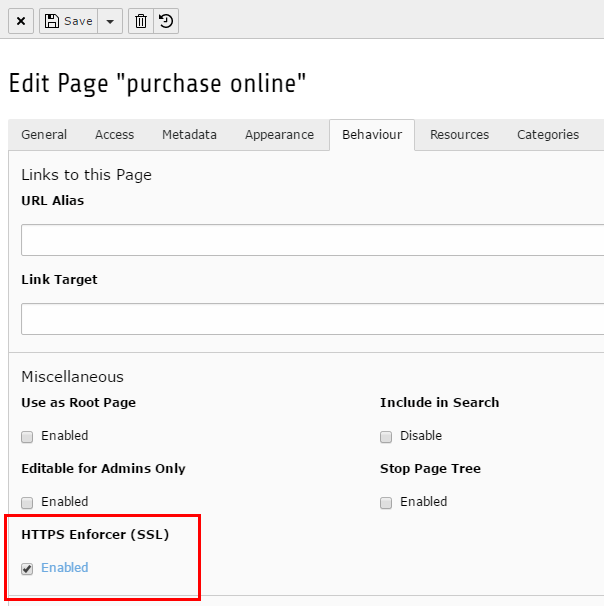

.. ==================================================
.. FOR YOUR INFORMATION
.. --------------------------------------------------
.. -*- coding: utf-8 -*- with BOM.

.. include:: ../../Includes.txt

.. _introduction-screenshots:

Screenshots
-----------

Since version 3.0.0 you will find the checkbox for activating SSL in the tab "Behaviour", palette "Miscellaneous".

The following screenshot outlines all the user configuration required to make a page secure or
insecure:

	
	Activate HTTPS Enforcer (SSL)

